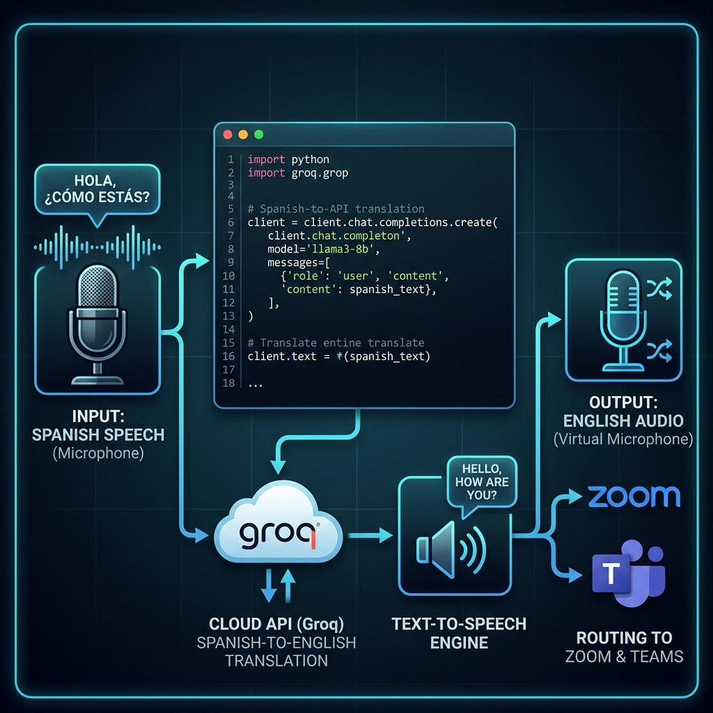

# 🎙️ Guía de Implementación: Traducción de Voz Saliente (Micrófono Virtual)

Este documento detalla el diseño, la configuración de audio en Ubuntu y el flujo de ejecución para implementar la traducción de tu propia voz en tiempo real. 

La idea es que puedas hablar en español por tu micrófono físico y que los receptores de tu videollamada (Zoom, Teams, Meet) escuchen una voz sintetizada en inglés sumamente natural.

---

## 🗺️ Arquitectura de Enrutamiento de Audio

Para que este sistema funcione sin interferencias, debemos separar físicamente lo que captura tu micrófono real de lo que escucha la aplicación de videollamadas.



---

## 🎛️ Configuración de Audio en Ubuntu (Paso a Paso)

Para preparar tu sistema operativo antes de ejecutar el código:

### 1. Crear el canal del Micrófono Virtual (`Virtual_Mic`)
En tu consola de Ubuntu, ejecuta el siguiente comando para crear el puente de grabación:
```bash
pactl load-module module-null-sink sink_name=Virtual_Mic sink_properties=device.description="Virtual_Mic"
```
*   Esto creará un dispositivo de salida virtual llamado `Virtual_Mic` y su correspondiente dispositivo de monitorización (`Virtual_Mic.monitor`) que actuará como tu nuevo micrófono virtual.

### 2. Configurar Zoom / Teams / Google Meet
Abre la configuración de audio de tu aplicación de videollamadas:
*   **Altavoces (Salida):** Configura tu salida física normal (auriculares o cornetas) o la tubería `Virtual_Cable` si también estás traduciendo lo que entra.
*   **Micrófono (Entrada):** Selecciona **`Virtual_Mic`** (o **`Virtual_Mic.monitor`**). *No selecciones tu micrófono físico real.*

---

## 🚀 Plan de Desarrollo Aislado

Desarrollaremos esta funcionalidad en un script independiente (por ejemplo, `src/services/mic_translator.py`) antes de integrarlo al flujo principal del sistema. El paso a paso de lo que hará este módulo es:

### Paso 1: Captura de Voz Local
*   Escuchar el canal de entrada correspondiente a tu micrófono físico usando la librería `sounddevice`.
*   Implementar un disparador de grabación:
    *   **Opción A (Pulsar para hablar):** Graba únicamente mientras mantengas presionada una tecla específica (como `Alt` o `Espacio`).
    *   **Opción B (Detección de silencio):** Graba continuamente y procesa el bloque cuando detecte que terminaste de hablar.

### Paso 2: Traducción Directa con Groq API
*   Convertir el fragmento de audio capturado en un archivo WAV temporal en memoria.
*   Hacer una llamada al endpoint de traducciones de Groq:
    ```http
    POST https://api.groq.com/openai/v1/audio/translations
    ```
    *Al usar el endpoint `/translations`, Groq recibe el audio en español y devuelve directamente la transcripción traducida al inglés en un solo paso.*

### Paso 3: Generación de Voz Natural (Edge-TTS)
*   Utilizar la librería `edge-tts` para convertir el texto en inglés recibido de Groq en un flujo de audio hablado con voz humana e inyectarlo en Python.

### Paso 4: Reproducción en la Tubería Virtual
*   Configurar `sounddevice` para reproducir el archivo de audio de Edge-TTS dirigiendo la salida específicamente hacia el dispositivo virtual `Virtual_Mic`.

---

## 📦 Dependencias Adicionales

Para cuando empecemos a escribir el código, necesitaremos instalar estas librerías:
```bash
pip install edge-tts keyboard
```
*   `edge-tts`: Para generar la voz humana en inglés de forma gratuita y natural.
*   `keyboard`: Para capturar las pulsaciones de teclado (Push-to-Talk) a nivel global en el sistema operativo.
